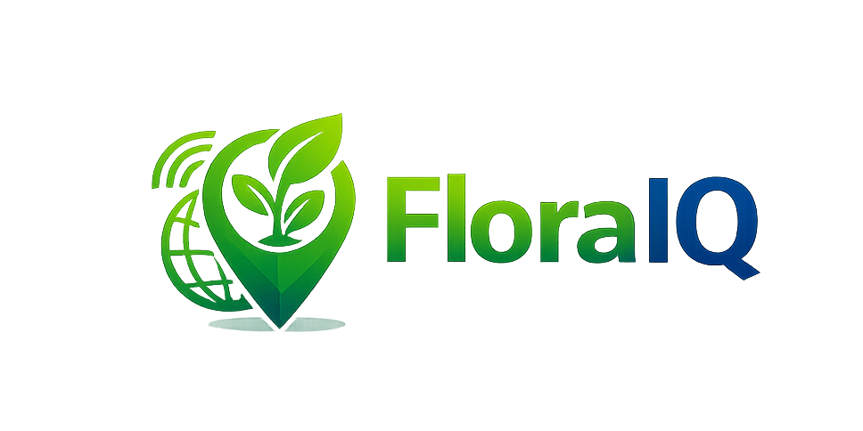
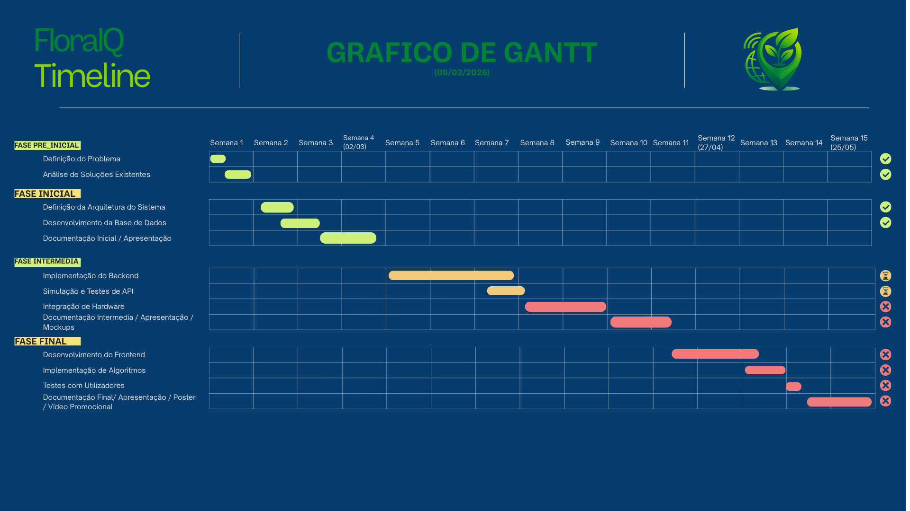

# FloralQ – Plataforma de Monitorização de Plantas

**Universidade Europeia / IADE – Engenharia Informática**  
**Projeto de Desenvolvimento Web – 4º Semestre (2025/2026)**  
**Autor**: Pedro António  

**GitHub**: [Repositorio GitHub](https://github.com/MelhorNarrador/ProjetoWeb_Pedro)

---

---

## Palavras-chave
IoT, sensores ambientais, monitorização de plantas, geolocalização, dashboard web, agricultura urbana, planeamento urbano

---

# 1. Descrição e Problema

O cuidado de plantas e espaços verdes é frequentemente baseado em observação manual e experiência empírica.  
Muitas pessoas têm dificuldade em perceber **quando regar uma planta**, o que pode levar a problemas como excesso ou falta de água.

Além disso, a monitorização de plantas em jardins ou espaços urbanos não é normalmente acompanhada por dados objetivos em tempo real.

A **FloralQ** pretende resolver este problema através de uma plataforma que combina **sensores físicos de humidade do solo e localização GPS** com uma **aplicação web**, permitindo monitorizar o estado das plantas e analisar dados ao longo do tempo.

---

# 2. Objetivos & Motivação

## Objetivos

- Desenvolver uma aplicação web para monitorização de plantas.
- Integrar sensores IoT para recolha de dados.
- Guardar e analisar leituras de humidade do solo.
- Apresentar dados num dashboard visual.
- Mostrar a localização da planta num mapa interativo.
- Permitir a gestão de múltiplas plantas por utilizador.

## Motivação

Mesmo com o crescimento de **espaços verdes urbanos** e com o geral interesse por plantas domésticas, prova-se dificil encontrar uma plataforma que disponha de ferramentas tecnológicas que ajudem na manutenção correta de plantas de forma acessível.

O FloralQ pretende tornar a monitorização **mais precisa, automatizada e acessível**, combinando hardware simples com uma interface web intuitiva.

---

# 3. Público-alvo

O projeto dirige-se a diferentes perfis de utilizadores:

- **Utilizadores domésticos**  
 Pessoas com plantas em casa ou pequenos jardins,

- **Jardins privados**  
  Proprietários que desejam monitorização mais precisa.

- **Gestores de espaços verdes urbanos**  
  Gestão de espaços verdes municipais.

---

# 4. Pesquisa de Mercado

| Plataforma | Pontos fortes | Pontos fracos | Oportunidade para FloraIQ |
|------------|---------------|-----------|---------------------------|
| Planta App | Interface intuitiva, Recomendações personalizadas, Identificação por imagem | Não utiliza sensores físicos, Baseia-se apenas em inputs manuais | Integração de sensores reais com dados automáticos |
| Weenat | Monitorização com sensores reais, Dados ambientais detalhados | Foco exclusivo na agricultura profissional, Sistema complexo e pouco acessível ao utilizador comum | Solução mais simples e acessível |

O **FloraIQ** diferencia-se por integrar **sensores físicos** num **sistema acessível** a **utilizadores domesticos e urbanos** permitindo monitorizar niveis de **humidade em tempo real** com **localização GPS**.

---

# 5. Guiões de Teste

### Guião 1 – Monitorizar uma planta

1. O utilizador cria uma conta na plataforma.  
2. Regista uma nova planta no sistema.  
3. Associa um dispositivo sensor à planta.  
4. O dispositivo envia leituras de humidade para o servidor.  
5. O dashboard apresenta os dados da planta.

**Resultado esperado**: O utilizador consegue acompanhar o estado da planta.

---

### Guião 2 – Visualizar dados da planta

1. O utilizador acede ao dashboard.  
2. Seleciona uma planta registada.  
3. Visualiza o histórico de humidade do solo.  
4. Consulta a localização da planta no mapa.

**Resultado esperado**: O utilizador compreende facilmente o estado da planta.

---

### Guião 3 – Receber nova leitura do sensor

1. O dispositivo ESP32 mede a humidade do solo.  
2. Envia os dados para a API do servidor.  
3. O servidor guarda a leitura na base de dados.  
4. O dashboard apresenta a nova leitura.

**Resultado esperado**: O sistema atualiza automaticamente os dados.

---

# 6. Descrição da Solução

## 6.1 Enquadramento nas UCs

### Sistemas de Informação Geográficos
A aplicação inclui integração com sistemas de informação geográfica para visualizar a localização das plantas num mapa.  
Os dados de latitude e longitude recolhidos pelo sensor GPS são apresentados numa interface com mapa interativo, permitindo localizar cada planta e visualizar as leituras associadas.

### Programação Web
A lógica principal da aplicação é desenvolvida em **PHP**, responsável por:
- gerir utilizadores e autenticação,
- receber dados enviados pelo dispositivo IoT,
- armazenar leituras na base de dados,
- disponibilizar dados através de endpoints para o dashboard.

### Interfaces e Usabilidade
A interface web do sistema é desenvolvida com **HTML, CSS e JavaScript**, com foco numa experiência de utilização simples e intuitiva.  
O dashboard apresenta informação relevante de forma clara.

### Estatística
Os dados recolhidos pelos sensores permitem realizar análises simples, como:
- média de humidade do solo,
- evolução temporal das leituras,
- comparação com valores ideais definidos para cada tipo de planta.

Estas análises permitem interpretar o estado da planta ao longo do tempo.

### Algoritmos e Estrutura de Dados
O sistema inclui lógica de processamento de dados para interpretar as leituras dos sensores.  
A partir das leituras de humidade, podem ser aplicados algoritmos simples para detetar padrões ou prever situações de secura, auxiliando na manutenção das plantas.

### Projeto de Desenvolvimento Web
Esta unidade curricular estrutura o desenvolvimento global do projeto, incluindo:
- planeamento do sistema,
- definição da arquitetura da aplicação,
- integração entre hardware, backend e interface web,
- documentação e organização do trabalho.

---

## 6.2 Requisitos

### Requisitos Funcionais

- Registo e autenticação de utilizadores  
- Criação e gestão de múltiplas plantas 
- Associação de dispositivos a plantas  
- Receção de dados enviados por sensores IoT  
- Visualização de leituras de humidade  
- Visualização da localização da planta em mapa
- Algoritmos preditivos

### Requisitos Não Funcionais

- Reconhecimento de doenças por imagem (Plant.id API)
- Alertas por email

---

## 6.3 Arquitetura

A arquitetura do sistema segue um modelo simples de três camadas:

**Dispositivo IoT**
- ESP32  
- Sensor de humidade do solo  
- Módulo GPS  

↓

**Servidor Backend**
- API em PHP responsável por receber e processar dados  

↓

**Base de Dados**
- PostgreSQL para armazenamento de utilizadores, plantas e leituras  

↓

**Dashboard Web**
- Interface desenvolvida em HTML, CSS e JavaScript  
- Visualização de dados e mapas interativos  

Esta arquitetura permite separar claramente as responsabilidades entre recolha de dados, processamento e visualização.

---

## 6.4 Tecnologias a Utilizar

### Backend
- PHP   

### Base de Dados
- PostgreSQL  

### Frontend
- HTML  
- CSS  
- JavaScript  

### Hardware IoT
- ESP32  
- Sensor de humidade do solo  
- Módulo GPS  

### Ferramentas de Desenvolvimento
- VSCode  
- GitHub  
- Postman  
- pgAdmin4

---

# 7. Planeamento

## Grafico de Gantt (08/03/2026)

---
