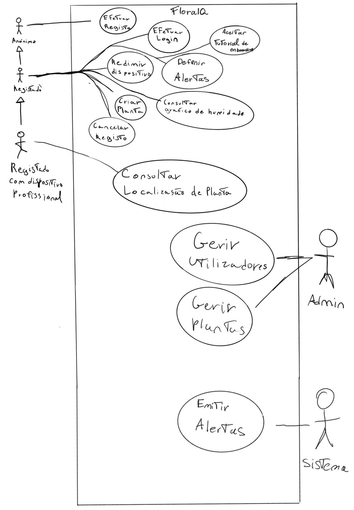
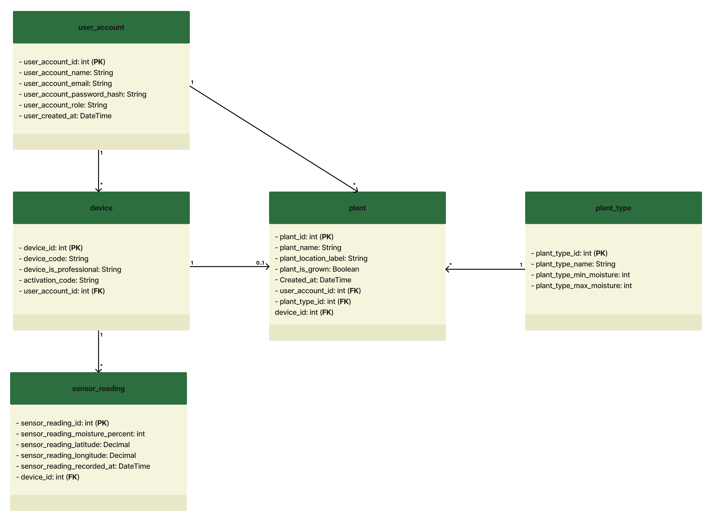
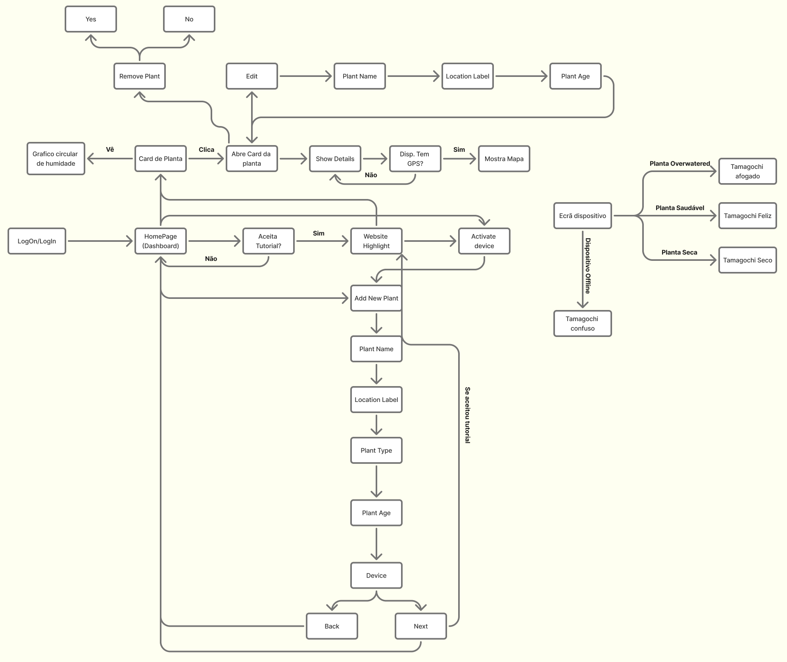
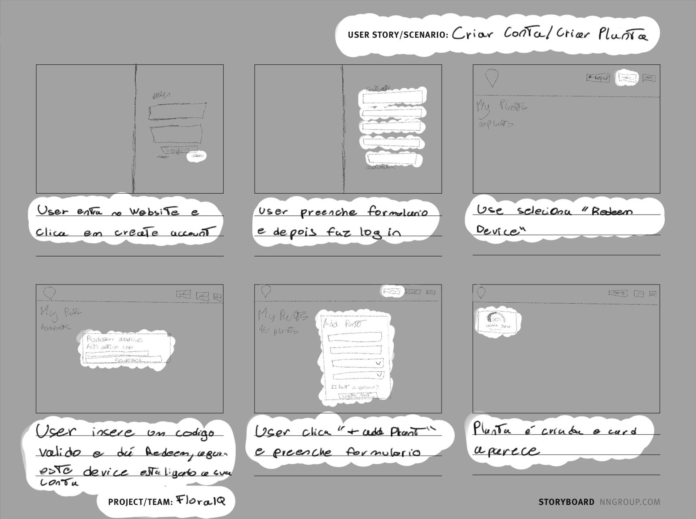
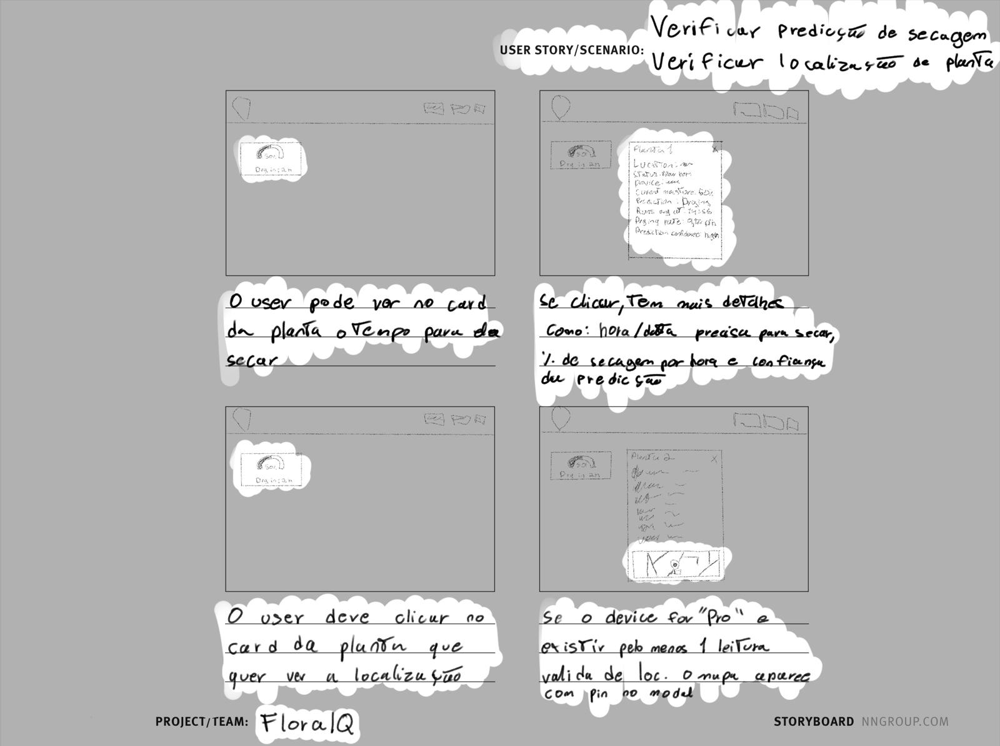
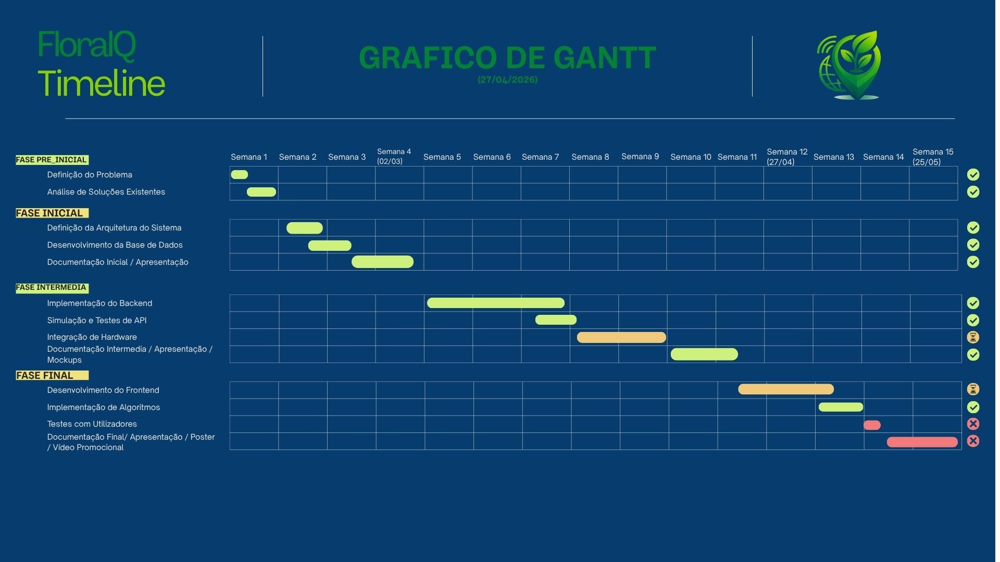

# FloralQ – Plataforma de Monitorização de Plantas

**Universidade Europeia / IADE – Engenharia Informática**  
**Projeto de Desenvolvimento Web – 4º Semestre (2025/2026)**  
**Autor**: Pedro António  

**GitHub**: [Repositorio GitHub](https://github.com/MelhorNarrador/ProjetoWeb_Pedro)

---

---

## Palavras-chave 
IoT, sensores ambientais, monitorização de plantas, geolocalização, dashboard web, agricultura urbana, planeamento urbano

---

## 1. Introdução  

A **FloralQ** é uma **plataforma web de monitorização de plantas** que combina **sensores IoT** com uma **interface web**, permitindo aos utilizadores acompanhar o estado das suas plantas em tempo real.
Na **primeira entrega**, foram definidos o **conceito**, o **público-alvo** e a **arquitetura geral** do sistema. Foi também implementada a primeira versão da **base de dados** e iniciado o desenvolvimento do backend.
Nesta **segunda entrega**, o foco foi o **desenvolvimento do protótipo funcional**, incluindo a implementação completa da **API**, a integração com o **hardware**, o **algoritmo preditivo** de secagem e os mockups das interfaces finais.

---

## 2. Enquadramento e Problema  

O **cuidado de plantas** e espaços verdes é frequentemente **baseado em observação manual** e **experiência empírica**. Muitas pessoas têm dificuldade em perceber **quando regar uma planta**, o que pode levar a problemas como **excesso** ou **falta de água**. Além disso, a monitorização de plantas em jardins ou espaços urbanos não é normalmente acompanhada por dados objetivos.
A **FloralQ** pretende resolver este problema através de uma plataforma que combina sensores físicos de humidade do solo e localização GPS com uma aplicação web, permitindo monitorizar o estado das plantas e analisar dados ao longo do tempo.

---

## 3. Casos de uso  

### 3.1 Casos de Uso
  

O sistema da **FloralQ** tem **quatro atores**: o **utilizador Anónimo** (pode registar-se e fazer login), o **utilizador Registado** (gere plantas e dispositivos), o **utilizador Registado com dispositivo profissional** (tem acesso adicional à localização GPS da planta) e o **Admin** (gere utilizadores e plantas via backoffice). O **Sistema** é responsável por **emitir alertas**.
As funcionalidades de **tutorial de onboarding** e **definição de alertas** estão previstas para a **terceira entrega**.  

## 3.2 Modelo de Domínio
  

O modelo de domínio representa as cinco entidades centrais do sistema e as suas relações.  

---

## 4. Arquitetura e Tecnologias  

A arquitetura do sistema segue um modelo Cliente–Servidor em quatro camadas:

Dispositivo IoT: ESP32 com **sensor de humidade** do solo e **módulo GPS**. O dispositivo **FloralQ Home** incluirá também um **ecrã** com uma mascote estilo Tamagochi que reflete o estado da planta *(funcionalidade prevista para a terceira entrega)*.  
Backend: **API REST** em **PHP** responsável por receber, validar e processar dados  
Base de Dados: **PostgreSQL**  
Frontend Web: Interface desenvolvida em **HTML**, **CSS** e **JavaScript**  
  
O dispositivo ESP32 comunica diretamente com o backend via HTTP, enviando leituras de humidade e coordenadas GPS de 5 em 5 minutos.  
O frontend consome a mesma API para apresentar os dados ao utilizador.  

---

## 5. User Flows e Wireframes

### 5.1 User Flow  

O user flow ilustra a navegação completa da aplicação. Após o login, o utilizador chega ao dashboard onde pode:

Aceitar o tutorial e ser guiado pelo website *(funcionalidade prevista para a terceira entrega)*  
Adicionar uma nova planta preenchendo nome, localização, tipo, idade e associando um dispositivo  
Interagir com os cards de planta visualizando o gráfico de humidade, abrindo os detalhes e consultando o mapa GPS (caso o dispositivo tenha GPS)  
Editar ou remover uma planta a partir do modal de detalhes  
O ecrã do dispositivo apresenta uma mascote (estilo Tamagochi) cujo estado reflete o estado da planta, utilizado em dispositivos **FloralQ Home**  

### 5.2 User Stories / Storyboards  
  #### 5.2.1 Criar Conta / Criar Planta  
  

Flow:  

1. O utilizador entra no website e clica em "Create Account"  
2. Preenche o formulário de registo e faz login  
3. Seleciona "Redeem Device" e insere o código de ativação, o dispositivo fica ligado à sua conta  
4. Clica em "+ Add Plant" e preenche o formulário  
5. A planta é criada e o card aparece no dashboard  

  #### 5.2.2 Verificar Previsão de Secagem / Verificar Localização da Planta  
    
  
  Flow:  

1. O utilizador pode ver no card da planta o tempo estimado para secar
2. Se clicar, tem mais detalhes: hora/data prevista para secar, % de secagem por hora e confiança da previsão
3. Para ver a localização, o utilizador clica no card da planta que quer consultar
4. Se o dispositivo for **FloralQ Professional** e existir pelo menos 1 leitura válida de GPS, o mapa aparece com pin no modal

---

## 6. Base de Dados  

A base de dados foi implementada em PostgreSQL, gerida com pgAdmin4.  
Schema: [Schema Base de Dados FloralQ](../Sql/Create1.0.sql)  

### 6.2 Dicionário de Dados  

| Tabela | Campo | Tipo | Constraints | Descrição |
|--------|-------|------|-------------|-----------|
| `user_account` | `user_account_id` | `SERIAL` | `PRIMARY KEY` | Identificador único do utilizador |
| `user_account` | `user_account_name` | `VARCHAR(100)` | `NOT NULL` | Nome do utilizador |
| `user_account` | `user_account_email` | `VARCHAR(255)` | `UNIQUE NOT NULL` | Email de login, único no sistema |
| `user_account` | `user_account_password_hash` | `TEXT` | `NOT NULL` | Hash bcrypt da password |
| `user_account` | `user_account_role` | `VARCHAR(20)` | `CHECK IN ('user','admin')` | Papel do utilizador no sistema |
| `user_account` | `user_created_at` | `TIMESTAMP` | `DEFAULT NOW()` | Data de criação da conta |
| `plant_type` | `plant_type_id` | `SERIAL` | `PRIMARY KEY` | Identificador único do tipo de planta |
| `plant_type` | `plant_type_name` | `VARCHAR(150)` | `NOT NULL` | Nome do tipo de planta (ex: Suculenta) |
| `plant_type` | `plant_type_min_moisture` | `INT` | `NOT NULL` | Limiar mínimo de humidade (%) |
| `plant_type` | `plant_type_max_moisture` | `INT` | `NOT NULL, CHECK (min ≤ max)` | Limiar máximo de humidade (%) |
| `device` | `device_id` | `SERIAL` | `PRIMARY KEY` | Identificador único do dispositivo |
| `device` | `device_code` | `VARCHAR(100)` | `UNIQUE NOT NULL` | Identificador físico do ESP32 |
| `device` | `device_is_professional` | `BOOLEAN` | `DEFAULT FALSE` | Indica se o dispositivo tem GPS |
| `device` | `activation_code` | `VARCHAR(10)` | `UNIQUE` | Código de 8 chars para vincular ao utilizador |
| `device` | `user_account_id` | `INT` | `FK → user_account` | Utilizador proprietário do dispositivo |
| `plant` | `plant_id` | `SERIAL` | `PRIMARY KEY` | Identificador único da planta |
| `plant` | `user_account_id` | `INT` | `NOT NULL FK → user_account` | Utilizador dono da planta |
| `plant` | `plant_type_id` | `INT` | `NOT NULL FK → plant_type` | Tipo de planta associado |
| `plant` | `device_id` | `INT` | `UNIQUE FK → device` | Relação 1:1 planta ↔ dispositivo |
| `plant` | `plant_name` | `VARCHAR(150)` | `NOT NULL` | Nome dado pelo utilizador à planta |
| `plant` | `plant_location_label` | `VARCHAR(150)` | — | Etiqueta de localização (ex: "Sala") |
| `plant` | `plant_is_grown` | `BOOLEAN` | `DEFAULT FALSE` | Indica se a planta é adulta ou em crescimento |
| `sensor_reading` | `sensor_reading_id` | `SERIAL` | `PRIMARY KEY` | Identificador único da leitura |
| `sensor_reading` | `device_id` | `INT` | `NOT NULL FK → device` | Dispositivo que gerou a leitura |
| `sensor_reading` | `sensor_reading_moisture_percent` | `INT` | `CHECK 0–100` | Percentagem de humidade lida pelo sensor |
| `sensor_reading` | `sensor_reading_latitude` | `DECIMAL(9,6)` | `NULLABLE` | Latitude GPS (null se sem sinal) |
| `sensor_reading` | `sensor_reading_longitude` | `DECIMAL(9,6)` | `NULLABLE` | Longitude GPS (null se sem sinal) |
| `sensor_reading` | `sensor_reading_recorded_at` | `TIMESTAMPTZ` | `DEFAULT NOW()` | Timestamp da leitura com fuso horário |

---

## 7. Documentação API REST  

O backend da **FloralQ** é uma API REST implementada em PHP   
A autenticação é feita via sessão PHP  
Os endpoints IoT não requerem sessão mas validam o device_code  

### 7.1 Autenticação

| Método | Endpoint | Body (JSON) | Descrição |
|--------|----------|-------------|-----------|
| `POST` | `/Auth/register.php` | `{ name, email, password }` | Regista um novo utilizador |
| `POST` | `/Auth/login.php` | `{ email, password }` | Autentica o utilizador, cria sessão PHP e devolve { success: true, user: { id, name, email, role } }|
| `POST` | `/Auth/logout.php` | — | Destrói a sessão atual |

### 7.2 Plantas e Dispositivos (Requerem Sessão)

| Método | Endpoint | Parâmetros | Descrição |
|--------|----------|------------|-----------|
| `GET` | `/API/get_user_plants.php` | — | Devolve todas as plantas do utilizador com última leitura de humidade |
| `GET` | `/API/get_plant_types.php` | — | Lista todos os tipos de planta disponíveis |
| `GET` | `/API/get_user_devices.php` | — | Lista dispositivos do utilizador sem planta associada |
| `POST` | `/API/create_plant.php` | `{ device_id, plant_type_id, plant_name, plant_location_label, plant_is_grown }` | Cria uma nova planta associada a um dispositivo |
| `POST` | `/API/redeem_device.php` | `{ activation_code }` | Vincula um dispositivo ao utilizador pelo código de ativação |
| `GET` | `/API/get_dry_prediction.php` | `?device_id=N` | Devolve a previsão de secagem com R², confiança e hora estimada |
| `GET` | `/API/get_location.php` | `?device_code=X` | Última localização GPS válida do dispositivo |
| `GET` | `/API/get_latest_reading.php` | `?device_code=X` | Leitura mais recente de humidade e GPS |
| `GET` | `/API/get_readings_history.php` | `?device_code=X&limit=N` | Histórico de leituras (máx. 2016, default 288) |
| `GET` | `/API/get_plant_status.php` | `?device_code=X` | Estado da planta (healthy/dry/overwatered) e do sensor (online/offline). Utilizado tanto pelo dashboard web como pelo ecrã do dispositivo. |

### 7.3 IoT (Sem Sessão)

| Método | Endpoint | Body / Parâmetros | Descrição |
|--------|----------|-------------------|-----------|
| `POST` | `/API/register_device.php` | `{ device_code, is_professional }` | Regista o dispositivo e devolve o `activation_code` |
| `POST` | `/API/insert_reading.php` | `{ device_code, moisture, latitude?, longitude? }` | Insere leitura de humidade e GPS (opcional) |
| `GET` | `/API/get_plant_info.php` | `?device_code=X` | Informação da planta associada ao dispositivo |  

### 7.4 Testes do Algoritmo Preditivo
Os seguintes resultados foram obtidos via GET no Postman com dados simulados

Inserts de teste: [Inserts DB Algoritmo FloralQ](../Sql/Inserts_teste_algoritmo.sql)  

Resultados dos testes [Resultados DB Algoritmo FloralQ](../Sql/insert_results.md)  

---

## 8. UI Assets, Design System e Interfaces Finais  

O processo de design da **FloralQ** foi documentado em dois momentos distintos, uma investigação UX que incluiu entrevistas a utilizadores, definição de personas, cenários de utilização e jornada de utilizador e de seguida, foi desenvolvido um Web Style Guide completo com paleta de cores, tipografia, iconografia, componentes de UI e regras de utilização do logótipo, tanto em light mode como em dark mode.
Toda a documentação de design está disponível nos seguintes documentos:  
[UX Case Study](UI_Assets_&_Design_System/FloralQ_Fase1_ESTRATÉGIA_E_PESQUISA_PedroAntónio_20241273.pdf)  
[Web Style Guide](UI_Assets_&_Design_System/FloralQ_Fase2_ESTRUTURA_FUNCIONAL_&_VISUAL_PedroAntónio_20241273.pdf)  

---

## 9. Esquema da Solução Técnica  

O sistema da **FloralQ** é composto por **quatro camadas** que comunicam entre si: o **dispositivo IoT**, o **backend PHP**, a **base de dados PostgreSQL** e o **frontend web**.  

Fluxo IoT: No arranque, o ESP32 regista-se automaticamente enviando o seu **device_code** para o backend, que gera e devolve um **activation_code** único. A partir daí, de **5 em 5 minutos**, o dispositivo lê o sensor de humidade do solo, obtém as coordenadas GPS (se disponível) e envia esses dados via **HTTP POST** para o endpoint **insert_reading.php**. O backend valida os dados e insere a leitura na tabela **sensor_reading**.  

Fluxo Web: O utilizador **autentica-se** através da página de login, que cria uma **sessão PHP server-side**. Todas as **páginas e endpoints** protegidos **verificam esta sessão** através do middleware **requireAuth()**. O dashboard **consome os endpoints** REST **via JavaScript**, apresentando os dados em **gráficos de humidade (Chart.js)** e **mapas de localização (Google Maps embed)**. **Ações** como adicionar plantas ou resgatar dispositivos **são feitas** através de **modals** que comunicam diretamente com a API.  

Segurança: As **passwords** são armazenadas com **hash bcrypt**. Todos os **acessos à base de dados** usam **prepared statements PDO** para prevenção de **SQL Injection**. A separação entre endpoints públicos (IoT e Auth) e protegidos (API) é garantida pelo middleware.  

---

## 10. Planeamento e Execução  

O desenvolvimento da **FloralQ** foi organizado em quatro fases ao longo de 15 semanas, documentadas no gráfico de Gantt abaixo.

---

## 11. Conclusão

Nesta **segunda entrega**, a **FloralQ** evoluiu de um conceito para um **protótipo funcional**. O **backend** está completo com **todos os endpoints REST implementados e testados**, a **base de dados** está **finalizada com as relações e constraints definidos** e o **dashboard web** permite ao utilizador **gerir as suas plantas**.  
O **algoritmo preditivo de secagem**, baseado em **regressão linear** com **filtragem de outliers** (IQR) e **cálculo de confiança**, é um dos pontos diferenciadores da plataforma e foi extensivamente **testado** com dados simulados no Postman.  
Para a **terceira e última entrega**, o foco será a **implementação dos alertas de rega por In-App e email**, o **tutorial de onboarding**, o **backoffice de administração** e os **gráficos de histórico de humidade** ao longo do tempo. Como **trabalho adicional**, estão previstos o **dark/light mode**, a **customização da interface pelo utilizador** e a **recuperação de password via email**.
